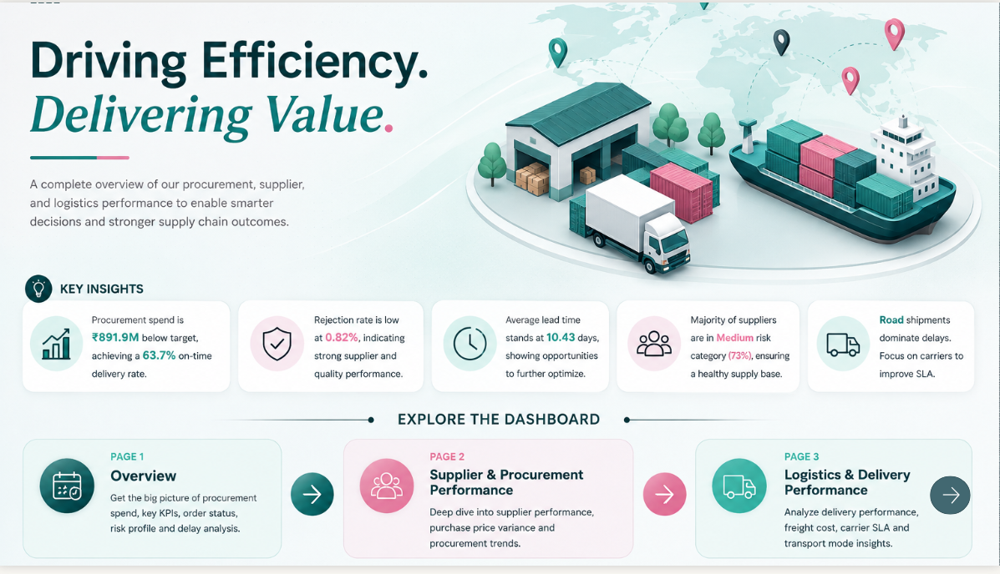
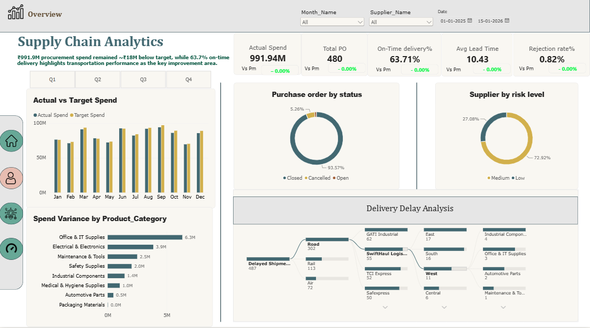
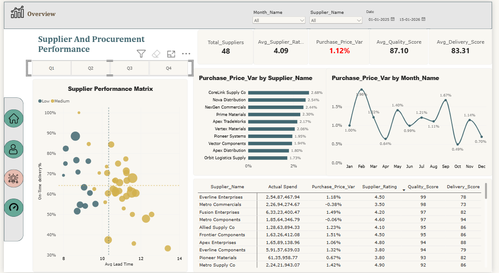
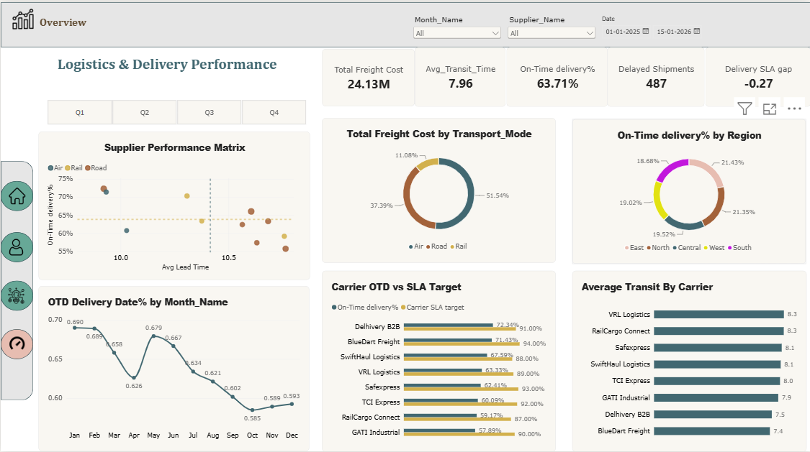
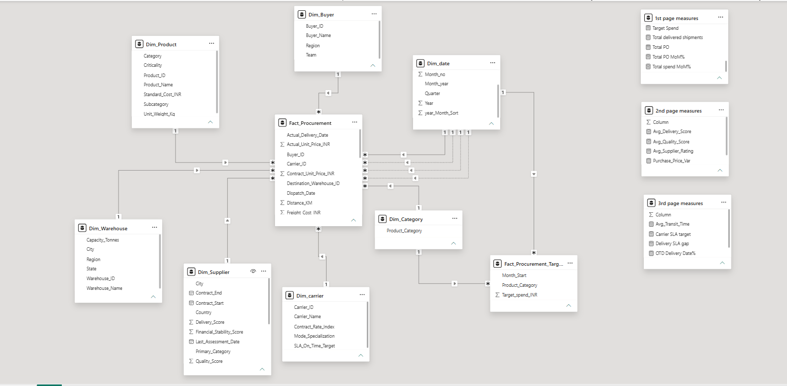

# 📦 Supply Chain Analytics Dashboard — Power BI

A Power BI dashboard that tracks procurement spending, supplier performance, and delivery operations for a fictional India-based company across 2025.

---

## 📋 What This Dashboard Shows

| Page | What You See |
|------|-------------|
| 🏠 Landing Page | Project summary and key highlights |
| 📈 Page 1 — Overview | Total spend vs target, purchase orders, delivery rate, delay analysis |
| 🤝 Page 2 — Supplier & Procurement | Supplier rankings, price variance, quality and delivery scores |
| 🚚 Page 3 — Logistics & Delivery | Freight costs, carrier performance, on-time delivery trends |

---

## 📊 Key Numbers (Full Year 2025)

- 💰 **₹991.9M** total procurement spend
- 📋 **480** purchase orders processed
- ✅ **63.7%** on-time delivery rate
- ⏱️ **10.43 days** average lead time
- 🔄 **0.82%** rejection rate
- 🏭 **48** suppliers across India
- 🚛 **487** delayed shipments — mostly road transport

---

## 🗄️ About the Dataset

The data was custom-built in Excel for this project. It simulates a real procurement system with 12 tables:

| Table | What It Contains |
|-------|-----------------|
| Procurement (H1 + H2) | 1,383 purchase order lines across Jan–Dec 2025 |
| Logistics Shipments | 1,375 shipment records with carrier, mode, freight cost, delivery dates |
| Supplier Master | 48 suppliers — name, location, contract dates, tier |
| Supplier Risk Rating | Risk level, quality score, delivery score per supplier |
| Product Master | 96 products with category, cost, criticality |
| Carrier Master | 8 carriers — BlueDart, Delhivery, VRL, Safexpress, etc. |
| Warehouse Master | 10 warehouses across India by region |
| Buyer Master | 15 buyers across procurement teams |
| Quantity Log | Ordered vs received quantities per PO line |
| Procurement Targets | Monthly spend targets by product category |

---

## 🔗 How the Data is Connected

All tables connect to a central fact table called `Fact_Procurement`:

```
Fact_Procurement  ──→  Dim_Supplier
                  ──→  Dim_Product
                  ──→  Dim_Buyer
                  ──→  Dim_carrier
                  ──→  Dim_Warehouse
                  ──→  Dim_Category
                  ──→  Dim_date  (3 connections: Order Date, Dispatch Date, Delivery Date)
```

> One thing worth noting: Power BI only allows one active date connection at a time. To calculate delivery-based metrics separately from order-based ones, specific DAX measures switch the active date connection on the fly.

---

## 📸 Screenshots

### 🏠 Landing Page


### 📈 Page 1 — Overview


### 🤝 Page 2 — Supplier & Procurement


### 🚚 Page 3 — Logistics & Delivery


### 🔗 Data Model


---

## 🛠️ Tools Used

- **Power BI Desktop** — dashboard design and data modeling
- **Power Query** — cleaning and combining the 12 Excel tables
- **DAX** — writing 30+ calculated measures for KPIs and month-over-month comparisons
- **Excel** — source dataset

---

## 🚀 How to Open This Project

1. Download the files from this repository
2. Open `SupplyChainDashboard.pbix` in Power BI Desktop (free to download from Microsoft)
3. If Power BI asks where the data is, point it to `Supply_Chain_Procurement.xlsx` in the same folder
4. Use the slicers at the top to filter by month, supplier, or date range

---

## 👤 Author

**Monjit Tamuli**
B.Tech — Electrical & Electronics Engineering, NIT Silchar
[GitHub](https://github.com/MONJIT07) · [LinkedIn](https://linkedin.com/in/) <!-- add your LinkedIn slug -->
